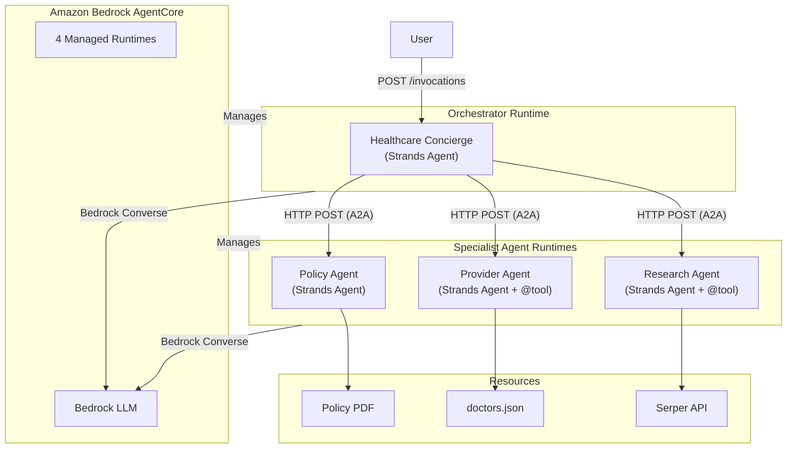

# Healthcare Agent — AWS Bedrock AgentCore

A multi-agent healthcare system deployed on [Amazon Bedrock AgentCore](https://docs.aws.amazon.com/bedrock/latest/userguide/agentcore.html) using the [Strands Agents SDK](https://strandsagents.com). Four specialized agents communicate via A2A-style HTTP to answer insurance questions, find providers, and research health conditions.

## Architecture

### System Diagram



### Agents

| Agent | Runtime | Role | Tools |
|---|---|---|---|
| **Healthcare Orchestrator** | `app/HealthcareAgent/` | Routes queries to specialist agents | `@tool` functions that call sub-agents via HTTP |
| **Policy Agent** | `app/PolicyAgent/` | Answers insurance coverage questions | Strands Agent with policy PDF in system prompt |
| **Provider Agent** | `app/ProviderAgent/` | Finds in-network doctors | `@tool list_doctors` over `doctors.json` (11 providers) |
| **Research Agent** | `app/ResearchAgent/` | Provides health info with citations | `@tool web_search` via [Serper API](https://serper.dev) |

### How It Works

1. User sends a question to the **Healthcare Orchestrator**
2. Orchestrator's Strands Agent decides which specialist `@tool` to invoke
3. Each `@tool` function makes an HTTP POST to the sub-agent's `/invocations` endpoint (A2A-style)
4. Sub-agents process the query using their own Strands Agent + specialized tools
5. Orchestrator **evaluates response quality** — if unsatisfactory, routes to a different agent
6. Final answer is **streamed back** to the user via `agent.stream_async()`

### Technology Stack

- **[Strands Agents SDK](https://strandsagents.com)** — Agent framework with native Bedrock tool use, `@tool` decorators, and `Agent-as-Tool` pattern
- **[Amazon Bedrock AgentCore](https://docs.aws.amazon.com/bedrock/latest/userguide/agentcore.html)** — Managed runtime with `BedrockAgentCoreApp`
- **A2A-style communication** — Agents communicate via HTTP POST to `/invocations`, following the Agent-to-Agent protocol pattern from the original AgentStack project

## Prerequisites

- **AWS Account** with Bedrock model access enabled for Claude Sonnet
- **AWS CLI v2** configured with credentials
- **Docker** — for local development via docker-compose
- **Serper API key** ([serper.dev](https://serper.dev)) — for the Research Agent

## Quick Start

### 1. Configure environment

```bash
cp .env.example .env
# Edit .env with your AWS credentials and Serper API key
```

### 2. Run with docker-compose

```bash
docker compose up --build
```

This starts all four agents on a shared Docker network. The orchestrator waits for sub-agents to be healthy.

### 3. Test

```bash
# Test the orchestrator (main entry point)
./scripts/invoke.sh "I need mental health assistance and live in Austin Texas"

# Test individual agents
./scripts/invoke.sh "What is my copay for office visits?" http://localhost:8081/invocations
./scripts/invoke.sh "Find doctors in Houston TX" http://localhost:8082/invocations
./scripts/invoke.sh "What are symptoms of diabetes?" http://localhost:8083/invocations

# Full test suite
./scripts/test-local.sh
```

## Deploy to AWS Bedrock AgentCore

### Option A: Code deployment (no Docker)

```bash
./scripts/create-iam-role.sh
./scripts/deploy-code.sh
```

### Option B: AgentCore CLI

```bash
cd agentcore && agentcore deploy
```

### Tear down

```bash
./scripts/cleanup.sh
```

## Configuration

### Environment Variables

| Variable | Required | Default | Description |
|---|---|---|---|
| `AWS_REGION` | No | `us-east-1` | AWS region for Bedrock and AgentCore |
| `BEDROCK_MODEL_ID` | No | `us.anthropic.claude-sonnet-4-20250514-v1:0` | Bedrock model (cross-region inference profile) |
| `SERPER_API_KEY` | Yes* | — | Serper API key for Research Agent |
| `POLICY_AGENT_URL` | No | `http://policy-agent:8080/invocations` | Policy Agent endpoint |
| `PROVIDER_AGENT_URL` | No | `http://provider-agent:8080/invocations` | Provider Agent endpoint |
| `RESEARCH_AGENT_URL` | No | `http://research-agent:8080/invocations` | Research Agent endpoint |
| `AWS_ACCOUNT_ID` | Yes** | — | For deployment scripts |
| `AGENTCORE_ROLE_ARN` | Yes** | — | IAM role ARN for AgentCore |

\* Only required if using the Research Agent.
\** Only required for deployment to AWS.

## Project Structure

```
healthcare-agent-agentcore/
├── agentcore/
│   ├── agentcore.json              # 4 runtime configs (CodeZip, Python 3.12)
│   ├── aws-targets.json
│   └── cdk/
├── app/
│   ├── HealthcareAgent/            # Orchestrator
│   │   ├── main.py                 # Strands Agent + @tool HTTP calls to sub-agents
│   │   └── pyproject.toml
│   ├── PolicyAgent/                # Policy specialist
│   │   ├── main.py                 # Strands Agent with PDF system prompt
│   │   ├── pyproject.toml
│   │   └── data/2026AnthemgHIPSBC.pdf
│   ├── ProviderAgent/              # Provider specialist
│   │   ├── main.py                 # Strands Agent + @tool list_doctors
│   │   ├── pyproject.toml
│   │   └── data/doctors.json
│   └── ResearchAgent/              # Research specialist
│       ├── main.py                 # Strands Agent + @tool web_search
│       └── pyproject.toml
├── scripts/
├── infrastructure/
├── Dockerfile                      # Parameterized (ARG AGENT_DIR)
└── docker-compose.yml              # 4 services
```

## Sample Questions

### Healthcare Orchestrator (multi-agent)
- "I need mental health assistance and live in Austin Texas. Who can I see and what is covered by my policy?"
- "I am pregnant and need care in Miami, Florida. What are my options?"

### Policy Agent
- "What is my coinsurance for office visits both in and out of network?"

### Provider Agent
- "What kind of doctors can I see in Houston Texas?"

### Research Agent
- "Tell me about the different types of diabetes."

## Known Limitations

- **Policy document scope**: Only has access to the Summary of Benefits and Coverage (SBC).
- **Provider database**: Limited to 11 sample providers.
- **Session memory**: In-memory; resets on container restart. Use [AgentCore Memory](https://docs.aws.amazon.com/bedrock/latest/userguide/agentcore-memory.html) for persistence.
- **Inter-agent auth**: Local/docker-compose uses unauthenticated HTTP. Production AgentCore endpoints are IAM-secured.

## License

Apache 2.0
